# Amazon_Vine_Analysis

## Overview of Project
Since your work with Jennifer on the SellBy project was so successful, you’ve been tasked with another, larger project: analyzing Amazon reviews written by members of the paid Amazon Vine program. The Amazon Vine program is a service that allows manufacturers and publishers to receive reviews for their products. Companies like SellBy pay a small fee to Amazon and provide products to Amazon Vine members, who are then required to publish a review.

In this project, you’ll have access to approximately 50 datasets. Each one contains reviews of a specific product, from clothing apparel to wireless products. You’ll need to pick one of these datasets and use PySpark to perform the ETL process to extract the dataset, transform the data, connect to an AWS RDS instance, and load the transformed data into pgAdmin. Next, you’ll use PySpark, Pandas, or SQL to determine if there is any bias toward favorable reviews from Vine members in your dataset. Then, you’ll write a summary of the analysis for Jennifer to submit to the SellBy stakeholders.

## Deliverables:
This new assignment consists of two technical analysis deliverables and a written report.

1. ***Deliverable 1:*** Perform ETL on Amazon Product Reviews
2. ***Deliverable 2:*** Determine Bias of Vine Reviews
3. ***Deliverable 3:*** A Written Report on the Analysis

# Deliverable 1:  
## Perform ETL on Amazon Product Reviews 
### Deliverable Requirements:

Using the cloud ETL process, you’ll create an AWS RDS database with tables in pgAdmin, pick a dataset from the [Amazon Review datasets](https://s3.amazonaws.com/amazon-reviews-pds/tsv/index.txt), and extract the dataset into a DataFrame. You'll transform the DataFrame into four separate DataFrames that match the table schema in pgAdmin. Then, you'll upload the transformed data into the appropriate tables and run queries in pgAdmin to confirm that the data has been uploaded.

1. From the following [Amazon Review datasets](https://s3.amazonaws.com/amazon-reviews-pds/tsv/index.txt), pick a dataset that you would like to analyze. All the datasets have the same schemata, as shown in this image:

2. Create a new database with Amazon RDS just as you did in this module.

3. In pgAdmin, create a new database in your Amazon RDS server that you just create.

4. Download the `challenge_schema.sql` file to your computer.

5. In pgAdmin, run a new query to create the tables for your new database using the code from the `challenge_schema.sql` file.

- After you run the query, you should have the following four tables in your database: customers_table, products_table, review_id_table, and vine_table.

6. Download the `Amazon_Reviews_ETL_starter_code.ipynb` file, then upload the file as a Google Colab Notebook, and rename it `Amazon_Reviews_ETL`.

**Note**
> If you try to open the `Amazon_Reviews_ETL_starter_code.ipynb` with jupyter notebook it will give you an error.

7. First **extract** one of the review datasets, then create a new DataFrame.
8. Next, follow the steps below to **transform** the dataset into four DataFrames that will match the schema in the pgAdmin tables:

**Note**
> Some datasets have a large number of rows, which will affect the time it takes to complete the following steps.

**The customers_table DataFrame**
To create the `customers_table`, use the code in the `Amazon_Reviews_ETL_starter_code.ipynb` file and follow the steps below to aggregate the reviews by `customer_id`.

* Use the `groupby()` function on the customer_id column of the DataFrame you created in Step 6.
* Count all the customer ids using the `agg()` function by chaining it to the `groupby()` function. After you use this function, a new column will be created, `count(customer_id)`.
* Rename the `count(customer_id)` column using the `withColumnRenamed()` function so it matches the schema for the `customers_table` in pgAdmin.
* The final `customers_table` DataFrame should look like this:

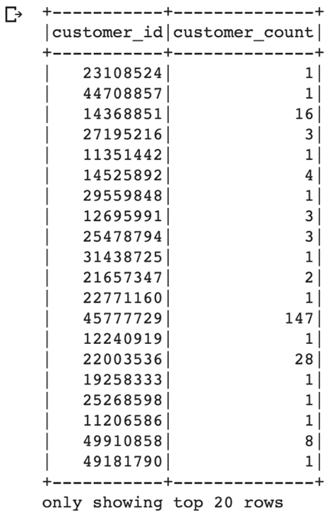

**The products_table DataFrame**
To create the `products_table`, use the `select()` function to select the `product_id` and `product_title`, then drop duplicates with the `drop_duplicates()` function to retrieve only unique `product_ids`. Refer to the code snippet provided in the `Amazon_Reviews_ETL_starter_code.ipynb` file for assistance.

The final `products_table` DataFrame should look like this:

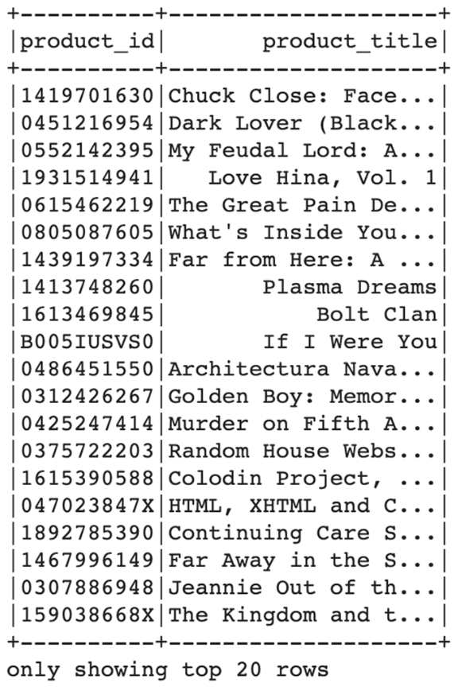

**The review_id_table DataFrame**
To create the `review_id_table`, use the `select()` function to select the columns that are in the `review_id_table` in [pgAdmin](https://docs.github.com/en/github/authenticating-to-github/removing-sensitive-data-from-a-repository), and convert the review_date column to a date using the code snippet provided in the `Amazon_Reviews_ETL_starter_code.ipynb` file.

The final `review_id_table` DataFrame should look like this:

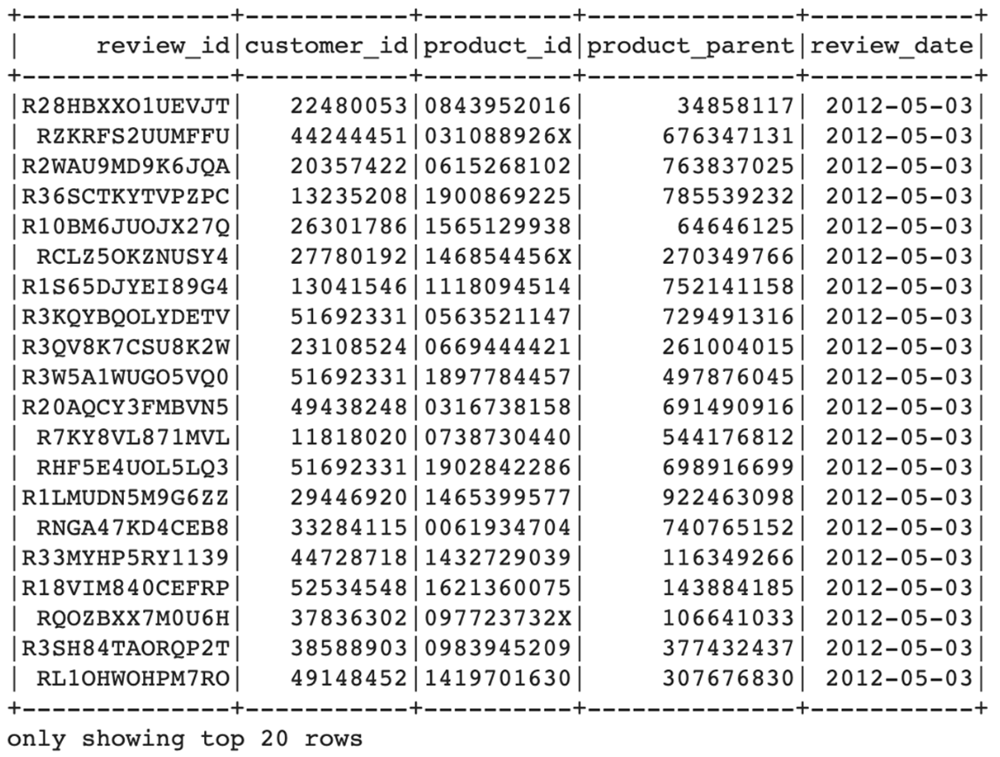

**The vine_table DataFrame**
To create the `vine_table`, use the `select()` function to select only the columns that are in the `vine_table` in [pgAdmin](https://docs.github.com/en/github/authenticating-to-github/removing-sensitive-data-from-a-repository).

The final `vine_table` DataFrame should look like this:

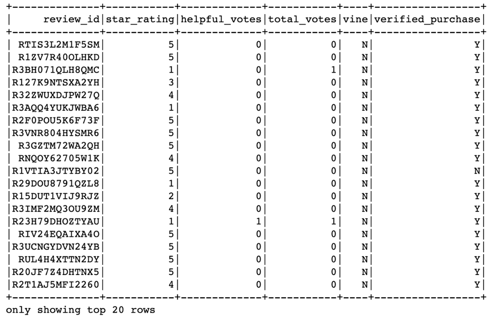

**Load the DataFrames into pgAdmin**
1. Make the connection to your AWS RDS instance.
2. Load the DataFrames that correspond to tables in pgAdmin.
3. In pgAdmin, run a query to check that the tables have been populated.

**Important**
> Before uploading anything to GitHub be sure to remove all sensitive information such as passwords and connection strings. If you have accidentally done so already see this link (Links to an external site.) for more information.

When you’re done, export your `Amazon_Reviews_ETL` Google Colab Notebook as an ipynb file, and save it to your Amazon_Vine_Analysis GitHub repository.

**Note**
Uploading each DataFrame can take up to 10 minutes or longer, so it’s a good idea to double-check your work before uploading. If you have problems uploading your work, you may have to shut down the pgAdmin server and restart. Alternatively, you may have to delete the tables and create them again, then re-run your `Amazon_Reviews_ETL` Google Colab Notebook.

**Important**
Be sure that you don’t leave your RDS instance running for too long. Try to get all your work for Deliverable 1 ASAP, then shut down your instance.

### Results:

**Helpful Reviews (All) with 5 Star:**  
For all reviews and "helpful" reviews, **56.5% of the ratings are 5 Star**, which indicates that the Vine programs tend to give 5 Stars over any other rating.

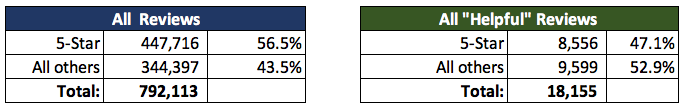

**Percentage of Vine Reviews are 5-star:**  
For all the Vine Reviews, it is comparable, **48.9% of the ratings are 5 Star**.

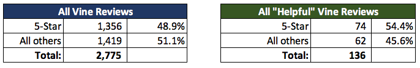

**Percentage of Non-Vine Reviews are 5-star:** 
The non-Vine reviews are higher than the Vine Reviews with **56.5% of the ratings are 5 Star**.

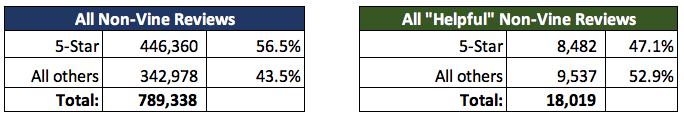

**Vine Review vs. Non-Vine Review**:   
For the entire Furniture product review file, the majority has a small Amazon Vine review: 

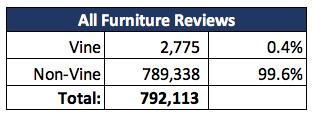

Applying the same analysis to the "helpful" reviews, it is found that an average percentage from the Vine program:  

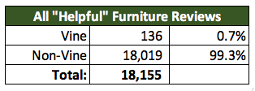

**5 Star Reviews Vine vs Non-Vine:** 
For the entire review dataset, we found a small 5 Star reviews from Vine reviews of **0.3%** 

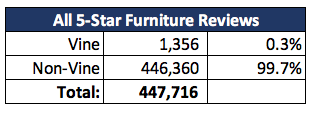

By filtering the "helpful" reviews only, there is a light difference; **a lower 1%** of the 5 Star review from Vine. 

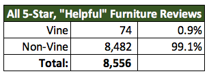

### Summary

1. The majority of reviews for Furniture product are almost minuscule from Vine participants: **99.6% are Non-Vine**.  
2. Overall, all 5 Star reviews are also the same as the Furniture, all are from Vine participants: **99.7% of all 5-star reviews are non-Vine**.
3. However, it is important to note that not all of the 5 Star reviews are coming from Vine participants.

### Recommendations

Below are some conclusions from the analysis that was conducted:

1. The Amazon Vine Analysis provides a favorable dataset on the 5-star rating.

> However, much of the data isn't Vine reviews over specific products, we could minimize the resluts and create a different dataset on just Vine products.

The analysis gave us that **1/4 are Vine Reviews**
  
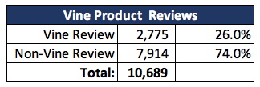 

Specific Product provide an average of **57% 5 Star reviews**  

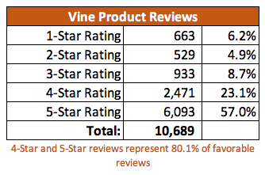  

For the majority of Vine Reviews, the analysis provide a **49% of 5 Star reviews**   

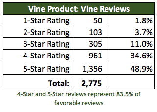 

And for the majority of the non-Vine Reviews, the analysis provide a **60% of 5 Star reviews**

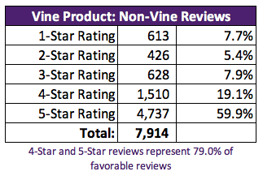

